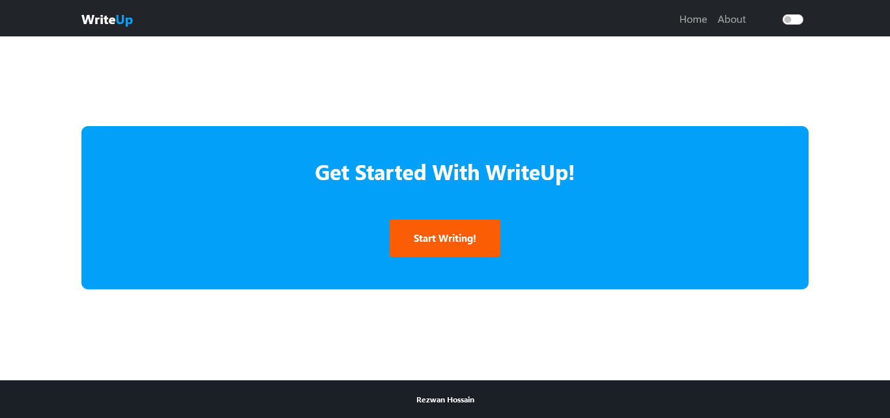
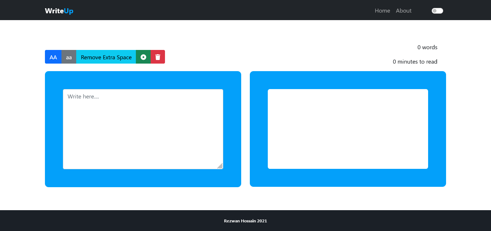
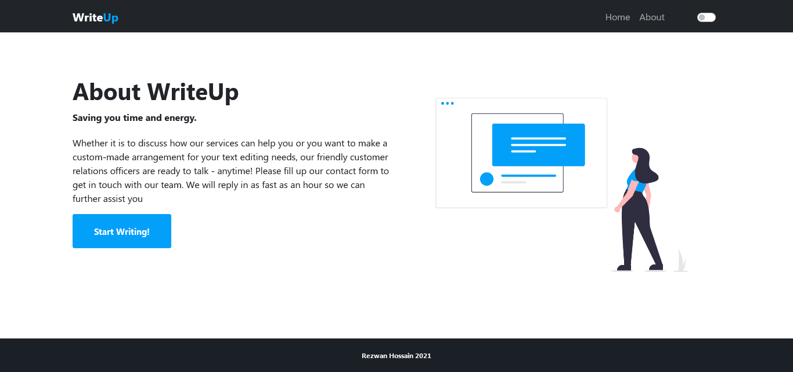
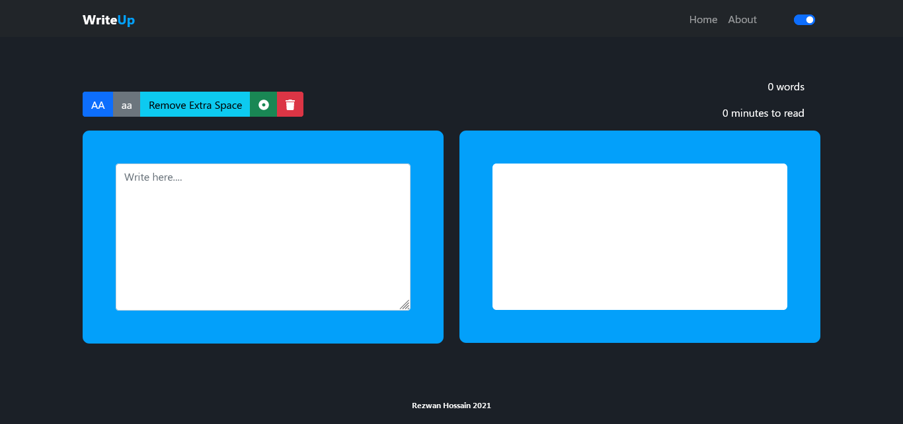
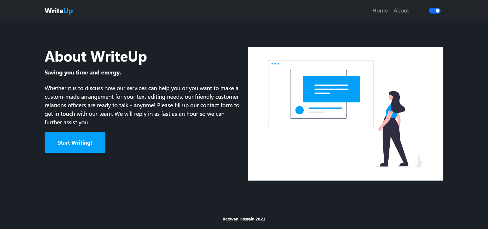

# WriteUp

WriteUp is a browser based minimal text editor which is capable of turning a word, sentence into uppercase, lowercase. It also can remove unnecessary extra spaces and make a sentence turn into a list. It's built using Vanilla JavaScript, Bootstrap 5 and Sass

Homepage

Actual Editor

About Page

Comes with dark mode as well

